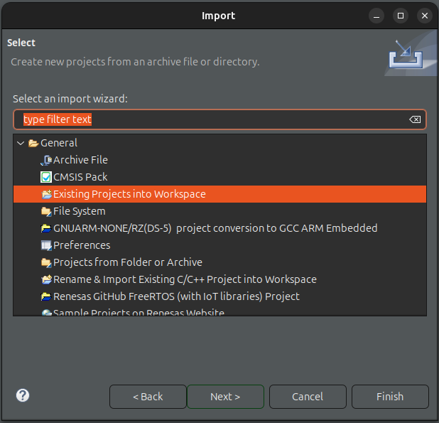
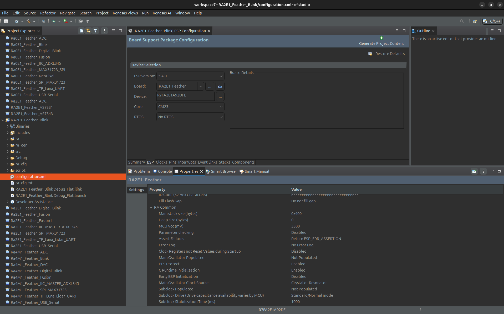
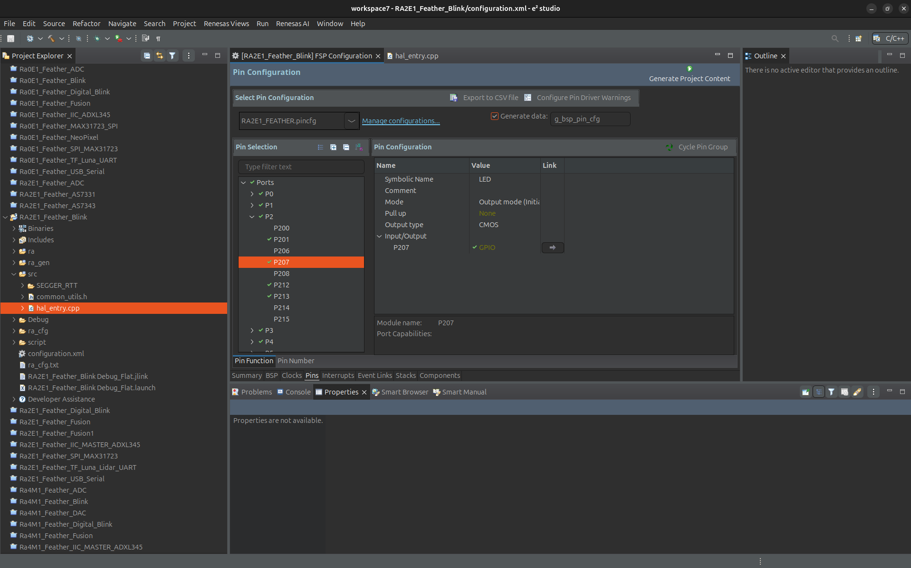
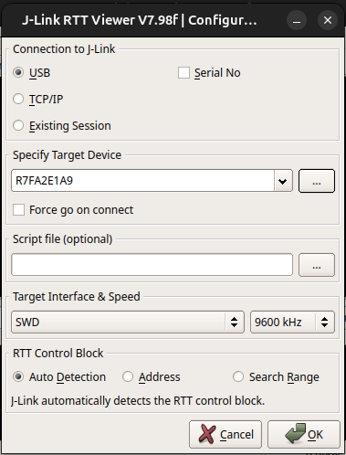

# Zalmotek RA2E1 Feather Blink

A simple LED blink example for the Zalmotek RA2E1 Feather board powered by Renesas RA2E1 microcontroller.

## Overview

This project demonstrates the basic functionality of the Zalmotek RA2E1 Feather board by blinking the onboard LEDs. It showcases simple GPIO control using the Renesas RA2E1 microcontroller, with the LEDs toggling at a 200ms interval.

## Hardware Requirements

- Zalmotek RA2E1 Feather board 
- USB cable for power and programming

## Software Requirements

- Renesas e² studio IDE
- Renesas FSP (Flexible Software Package)
- J-Link debugger software

## Features

- Simple LED blinking demonstration
- Utilizes Renesas RA FSP for GPIO control
- 200ms toggle interval for clear visual feedback
- SEGGER RTT support for debug output

## Code Functionality

The main application:
- Initializes the I/O ports using R_IOPORT_Open
- Enables pin access with R_BSP_PinAccessEnable
- Toggles all onboard LEDs between high and low states
- Uses a 200ms delay between state changes
- Runs in a continuous loop

## Getting Started

### Setup

### Setup

1. Clone this repository
2. Open the project in e2 studio
   In e² studio go to File -> Import..., choose "Existing Projects into Workspace" and browse to the project you’ve just downloaded, then click Finish:
   
<p align="center">
  
  
</p>

After importing your project, open the configuration.xml file to access the board configurator. Let's review some key settings that will be relevant for all your future RA2E1 Feather SoM projects. First of all, in the BSP tab, your project should have the Custom User Board and the R7FA2E1A92DFL device selected.

<p align="center">
  
</p>

Next, in the Pins tab, you may need to adjust this for future projects, based on what peripherals you want to enable. You can also set the pins as inputs or outputs and adjust their current drive capacity. For example, the LED is connected to P102 which is set to Output Mode. You can find its configuration in the Pin Selection menu ->Ports -> P2 -> P207.

<p align="center">
  
</p>

3. Connect your Zalmotek RA0E1 Feather board via USB
4. Build the project
5. Flash the firmware to the board

To run the project, click Generate Project Content, and then you can Build the project and Debug it. In the prompt that pops up, choose Debug as Renesas GDB Hardware Debugging. Click the Resume icon to begin executing the project. Reset the board and now the USR LED should be blinking.

If you want to access the J-Link RTT terminal for the SEGGER's J-Link RTT interface, you must download the RTT Viewer (link: https://www.segger.com/downloads/jlink/). For that, open the application and configure it according to the model below.

<p align="center">
  
  
</p>


### Configuration

The LED blink rate can be modified by changing the delay value:

```c
// Change this value to adjust blink speed (in milliseconds)
R_BSP_SoftwareDelay(200, bsp_delay_units);
```

## Project Structure

- `src/hal_entry.cpp`: Main application code with LED blinking implementation
- `src/common_utils.h`: Common utilities and definitions for the project
- `src/SEGGER_RTT/`: SEGGER RTT implementation for debug output
- `.settings/`: Project configuration files
- `configuration.xml`: FSP configuration file

## License

Renesas Electronics Corporation Proprietary

## Additional Resources

- [Zalmotek Website](https://zalmotek.com)
- [Zalmotek RA2E1 Website](https://zalmotek.com/products/RA2E1-Feather-SoM/)
- [SEGGER RTT Documentation](https://www.segger.com/products/debug-probes/j-link/technology/about-real-time-transfer/) 
